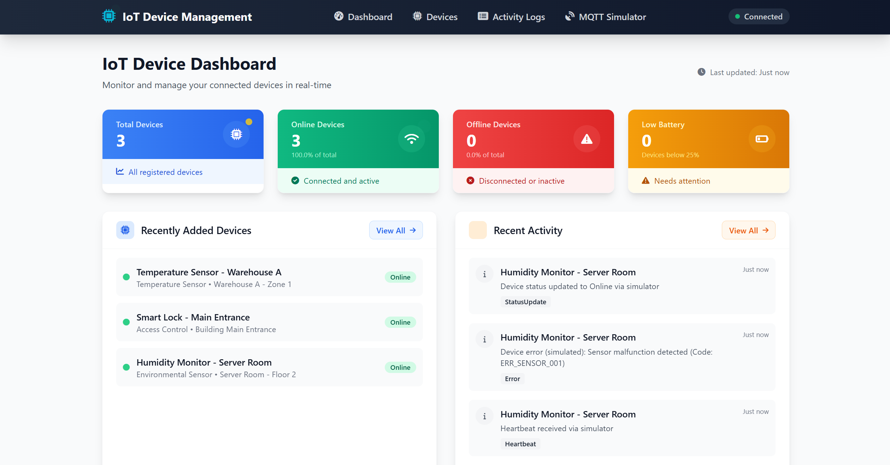
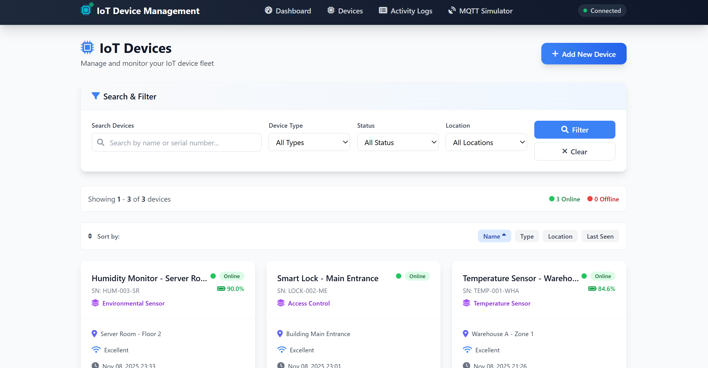
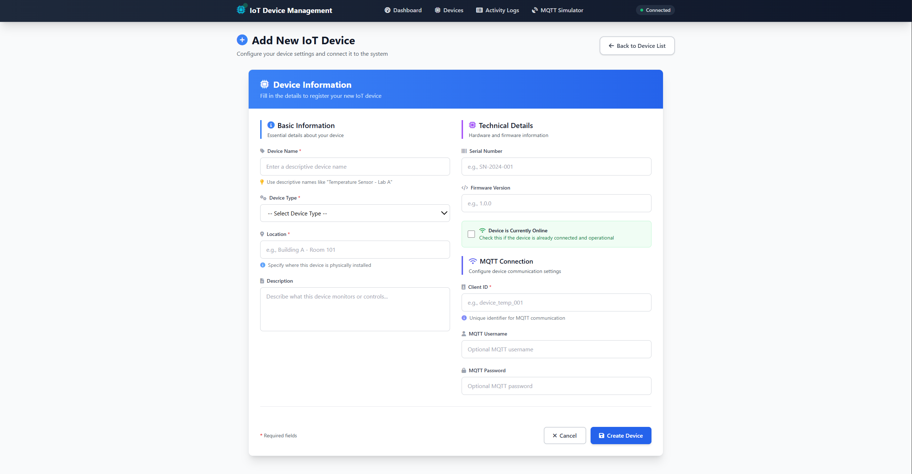
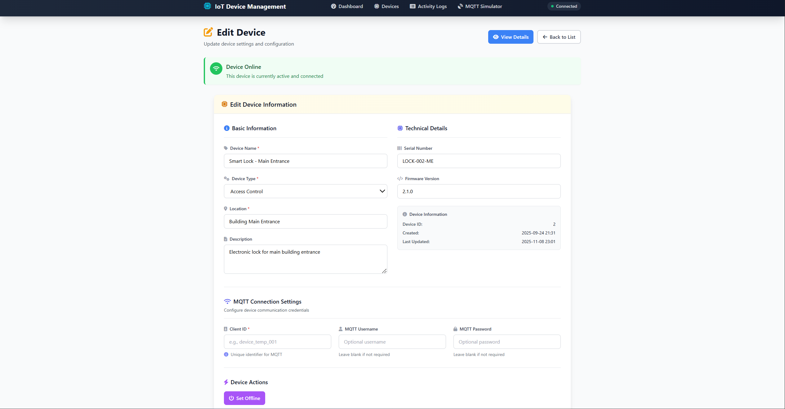
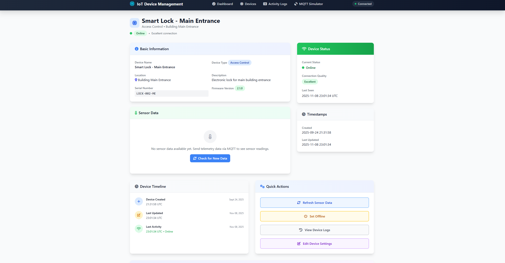
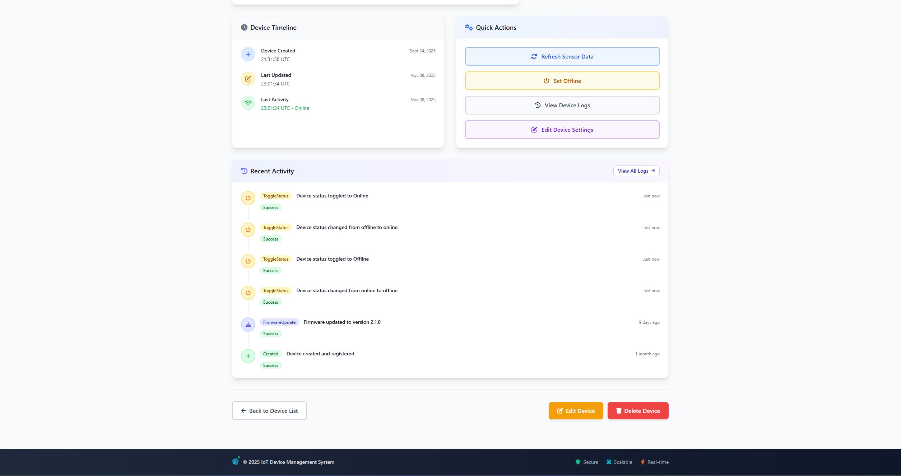
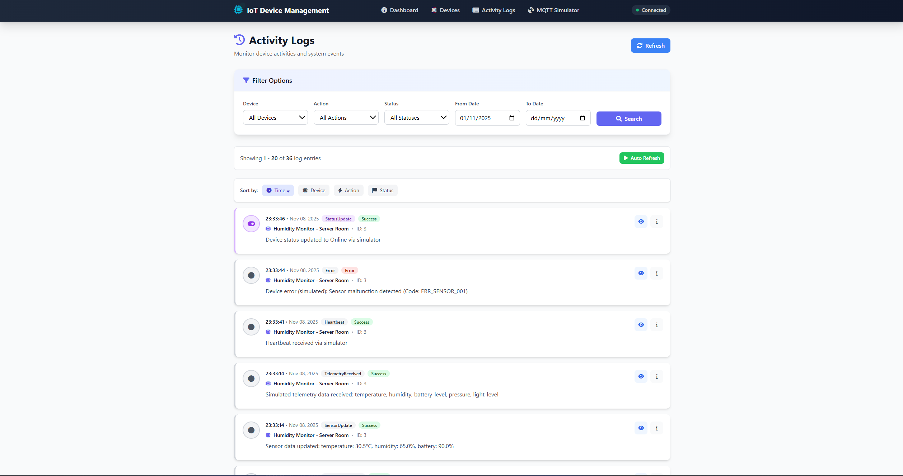
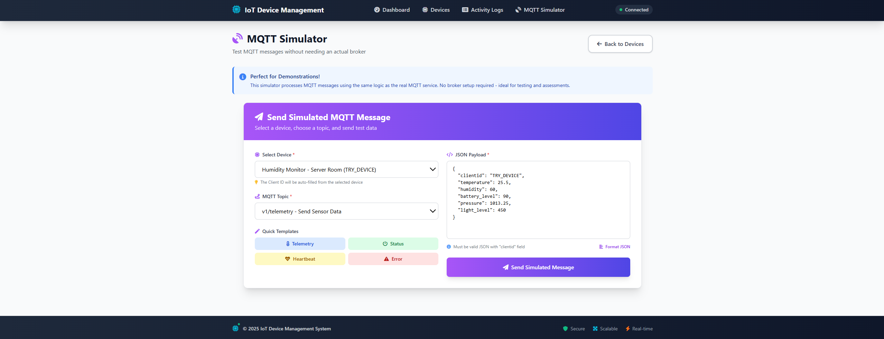

# 📸 Feature Showcase - IoT Device Management System

A visual guide to all features and capabilities of the IoT Device Management System.

---

## 📊 Dashboard - System Overview

### What You Can Do:

✅ **Monitor System Statistics**
- View total device count
- See online/offline device status
- Track low battery devices
- Real-time connection status

✅ **Quick Access to Recent Activity**
- View latest device actions and events
- See status updates, errors, and heartbeats
- Monitor telemetry data reception
- Click on activities to view details

✅ **Recently Added Devices**
- Quick overview of newest devices
- See device status at a glance
- Direct links to device details

---

## 🔧 Device Management - Device List

### What You Can Do:

✅ **View All Devices**
- Grid layout showing all registered devices
- Color-coded online/offline status
- Battery level indicators
- Connection quality display

✅ **Search & Filter**
- Search by device name or serial number
- Filter by device type (Temperature Sensor, Access Control, etc.)
- Filter by status (Online/Offline)
- Filter by location
- Sort by Name, Type, Location, or Last Seen

✅ **Quick Actions**
- Add new devices with one click
- View device details
- See device statistics
- Monitor connection quality

---

## ➕ Add New Device

### What You Can Do:

✅ **Basic Information**
- Enter device name with helpful hints
- Select device type from dropdown
- Specify installation location
- Add detailed description

✅ **Technical Details**
- Set serial number (with auto-generate option)
- Specify firmware version
- Mark device as online if already connected

✅ **MQTT Connection Settings**
- Configure Client ID (unique identifier)
- Optional MQTT username
- Optional MQTT password
- Ready for immediate device communication

✅ **Form Validation**
- Real-time field validation
- Required field indicators
- Helpful placeholder text
- Instant feedback on errors

---

## ✏️ Edit Device Settings

### What You Can Do:

✅ **Update Device Information**
- Modify device name and description
- Change device type
- Update location information
- View device status (Online/Offline)

✅ **Technical Configuration**
- Update serial number
- Change firmware version
- View device creation and update timestamps
- See device ID for reference

✅ **MQTT Connection Management**
- Update Client ID
- Change MQTT username
- Reset MQTT password
- Configure device communication settings

✅ **Device Actions**
- Set device offline manually
- Quick access to view device details
- Return to device list
- Persistent form validation

---

## 📱 Device Details - Overview

### What You Can Do:

✅ **Basic Information Panel**
- View complete device information
- See device type and location
- Check serial number and firmware version
- Monitor current online/offline status

✅ **Sensor Data Display**
- View latest telemetry readings
- No data message with helpful instructions
- Refresh button to fetch new data
- Auto-updates when new data arrives

✅ **Device Status Panel**
- Current connection status
- Connection quality indicator
- Last seen timestamp
- Real-time status updates

✅ **Device Timeline**
- Track device creation date
- Monitor last update time
- View last activity timestamp
- Complete activity history

---

## 📊 Device Details - Activity & Actions

### What You Can Do:

✅ **Device Timeline**
- Visual timeline of device events
- Color-coded activity icons
- Timestamps for each event
- Complete device history

✅ **Recent Activity Log**
- View all device activities
- See status changes (Online/Offline toggles)
- Monitor firmware updates
- Track device creation and modifications
- Success/Error indicators for each action
- Link to view all logs

✅ **Quick Actions Panel**
- **Refresh Sensor Data** - Fetch latest telemetry from database
- **Set Offline** - Manually change device status
- **View Device Logs** - See complete activity history
- **Edit Device Settings** - Quick access to configuration

✅ **Device Management**
- Edit device button for quick updates
- Delete device option (with confirmation)
- Back to device list navigation
- All actions with visual feedback

---

## 📜 Activity Logs

### What You Can Do:

✅ **Filter & Search Logs**
- Filter by specific device
- Filter by action type (Status Update, Error, Heartbeat, etc.)
- Filter by status (Success/Error)
- Date range filtering (From/To dates)
- Combined filtering for precise results

✅ **View Activity Details**
- Status Update events - Device online/offline changes
- Error events - Device errors and malfunctions
- Heartbeat events - Device connectivity checks
- Telemetry events - Sensor data reception
- Color-coded action types for quick identification
- Detailed error messages and descriptions

✅ **Sort & Navigate**
- Sort by Time, Device, Action, or Status
- Real-time data with auto-refresh option
- Pagination for large log sets
- Showing X of Y entries indicator
- Manual refresh button

✅ **Log Entry Information**
- Timestamp for each event
- Device name and location
- Device ID reference
- Action type with icon
- Success/Error status badge
- Detailed description of the activity

---

## 🛰️ MQTT Simulator

### What You Can Do:

✅ **Send Simulated MQTT Messages**
- No physical MQTT broker required!
- Perfect for testing and demonstrations
- Uses same backend logic as real MQTT
- Instant feedback and results

✅ **Device Selection**
- Select any registered device from dropdown
- Client ID automatically filled
- Device context maintained throughout

✅ **MQTT Topic Selection**
- **v1/telemetry** - Send sensor data (temperature, humidity, etc.)
- **v1/status** - Update device online/offline status
- **v1/heartbeat** - Send device heartbeat signal
- **v1/error** - Report device errors

✅ **Quick Templates**
- **Telemetry Template** - Pre-filled with random sensor values
  - Temperature, humidity, battery level
  - Pressure, light level, CO2, noise
  - Automatically includes device Client ID
- **Status Template** - Online/offline status message
- **Heartbeat Template** - Simple heartbeat signal
- **Error Template** - Error reporting with code and severity

✅ **JSON Payload Editor**
- Edit JSON directly
- Format JSON with one click
- Real-time validation
- Syntax highlighting
- Custom sensor data support

✅ **Message Sending**
- Send simulated message button
- Real-time processing
- Success/error notifications
- Toast message feedback

✅ **Testing Capabilities**
- Test telemetry data storage
- Verify device lookup by Client ID
- Check key dictionary creation
- Validate data processing logic
- Test activity log generation
- All without physical devices or broker!

---

## 🎯 Key Features Summary

### 📱 Device Management
- ✅ Create, Read, Update, Delete devices
- ✅ Real-time status monitoring
- ✅ Advanced filtering and search
- ✅ Bulk device overview
- ✅ Individual device details

### 📊 Data Visualization
- ✅ Dashboard with statistics
- ✅ Device status indicators
- ✅ Battery level monitoring
- ✅ Connection quality display
- ✅ Activity timelines

### 🔌 MQTT Integration
- ✅ Real-time device communication
- ✅ MQTT credentials management
- ✅ Topic-based messaging
- ✅ Telemetry data reception
- ✅ Status updates and heartbeats

### 🛰️ MQTT Simulator
- ✅ Test without physical broker
- ✅ Pre-built message templates
- ✅ JSON payload editor
- ✅ Instant feedback
- ✅ Perfect for demonstrations

### 📜 Activity Logging
- ✅ Complete event history
- ✅ Advanced filtering options
- ✅ Color-coded event types
- ✅ Detailed error tracking
- ✅ Real-time updates

### 🎨 User Interface
- ✅ Modern Tailwind CSS design
- ✅ Responsive layout
- ✅ Toast notifications
- ✅ Intuitive navigation
- ✅ Professional appearance

### 🔐 Data Management
- ✅ PostgreSQL database
- ✅ Persistent storage
- ✅ Relational data model
- ✅ Telemetry key-value storage
- ✅ Automatic migrations

---

## 🚀 Typical User Workflow

### 1️⃣ **Set Up Device**
1. Go to **Devices** → **Add New Device**
2. Fill in device information
3. Configure MQTT credentials
4. Click **Create Device**

### 2️⃣ **Test Communication**
1. Go to **MQTT Simulator**
2. Select your device
3. Choose **Telemetry** template
4. Click **Send Simulated Message**

### 3️⃣ **View Results**
1. Go to **Dashboard** - See updated statistics
2. Go to **Devices** - View your device with data
3. Click device → **Details** - See sensor readings
4. Check **Activity Logs** - Verify data reception

### 4️⃣ **Monitor & Manage**
1. Monitor device status on Dashboard
2. View activity logs for events
3. Update device settings as needed
4. Toggle device online/offline status

---

## 💡 Pro Tips

### 🎯 Quick Testing
- Use **MQTT Simulator** for instant results
- Click template buttons for pre-filled data
- Select different devices to test multiple scenarios
- View Activity Logs to verify all operations

### 📊 Data Monitoring
- Dashboard provides real-time overview
- Auto-refresh on Activity Logs keeps you updated
- Device details show latest sensor readings
- Timeline tracks all device events

### 🔧 Device Management
- Use filters to quickly find specific devices
- Sort by "Last Seen" to find inactive devices
- Edit device settings without leaving the page
- Quick actions panel for common tasks

### 🛰️ MQTT Simulator Benefits
- **No broker setup needed** for testing
- **Perfect for demonstrations** and assessments
- **Uses real backend logic** - production-ready
- **Instant feedback** - see results immediately
- **Any sensor data** - completely flexible

---

## 📚 Learn More

- **USER_GUIDE.md** - Complete step-by-step usage guide
- **DOCKER_SETUP_GUIDE.md** - How to run with Docker
- **MQTT_SIMULATOR_GUIDE.md** - Detailed simulator instructions
- **README.md** - Project overview and setup

---

## 🎉 Get Started!

1. **Run the application**: `docker-compose up -d`
2. **Open browser**: http://localhost:5212
3. **Create a device** in the Devices section
4. **Test with MQTT Simulator**
5. **View your results** on Dashboard and Device Details!

**Your IoT Device Management System is ready to use! 🚀**

